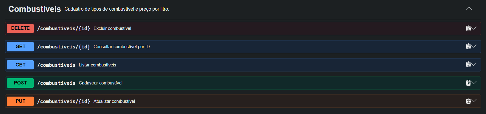
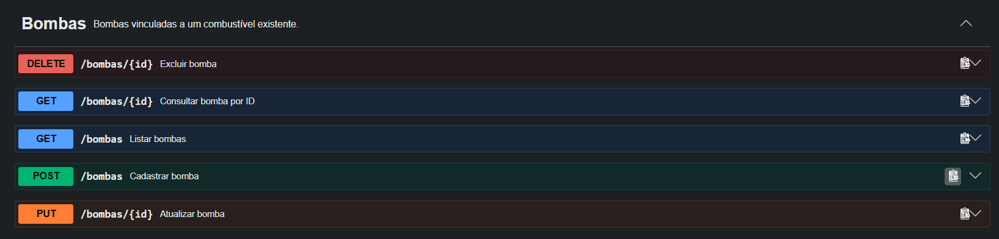
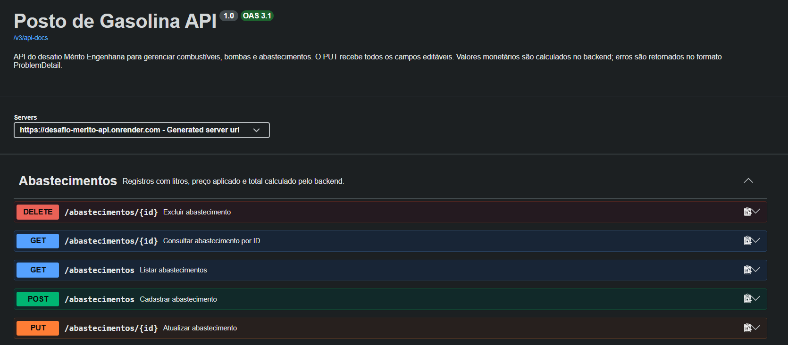

# Posto de Gasolina API

API REST em Java e Spring Boot para o desafio técnico da Mérito Engenharia. O banco PostgreSQL é criado e versionado pelo Flyway; o Hibernate valida o schema existente.

## API publicada

- [Swagger UI — testar os 15 endpoints](https://desafio-merito-api.onrender.com/swagger-ui/index.html)
- [URL base da API](https://desafio-merito-api.onrender.com)
- [Consulta de combustíveis](https://desafio-merito-api.onrender.com/combustiveis)
- [Contrato OpenAPI em JSON](https://desafio-merito-api.onrender.com/v3/api-docs)

A API está hospedada na Render e utiliza PostgreSQL no Neon, no projeto `posto-gasolina`, região Ohio. O banco é independente do container da API. A rota `/` não possui controller e retorna `404`; para consultar a aplicação, utilize o Swagger ou uma das rotas dos recursos.

No plano gratuito da Render, o serviço suspende após 15 minutos sem tráfego e a primeira requisição seguinte pode levar cerca de um minuto para responder. Aguarde a inicialização antes de testar. [Limitações da Render](https://render.com/docs/free#spinning-down-on-idle).

## Requisitos

- Docker Desktop com Docker Compose
- JDK 21 para executar a API ou os testes fora do Docker
- IntelliJ IDEA ou outro editor Java para desenvolvimento

O projeto inclui Maven Wrapper, então não é necessário instalar Maven globalmente.

## Configuração local

Na raiz do repositório, copie `.env.example` para `.env` e substitua os valores de senha de exemplo. O Docker Compose lê esse arquivo para configurar a API e o PostgreSQL.

## Executar API e banco pelo Compose

Na raiz do repositório, com o `.env` configurado:

```powershell
docker compose up -d --build
```

Esse comando constrói a imagem da API, inicia o PostgreSQL e aguarda o banco ficar disponível antes de iniciar a aplicação. Na inicialização, o Flyway aplica as migrações e o Hibernate valida o schema. Não é necessário instalar Java ou Maven no computador para essa execução.

A API fica disponível em `http://localhost:8080`. Aguarde a mensagem `Started PostoDeGasolinaApiApplication` nos logs antes de enviar requisições:

```powershell
docker compose logs -f api
```

Para uma primeira consulta, acesse `http://localhost:8080/combustiveis`. Se a porta `8080` estiver ocupada por uma execução na IDE, encerre essa execução ou altere `API_PORT` no `.env`, por exemplo para `8081`.

A API conecta ao banco pelo endereço interno `postgres:5432`; a porta `5434` serve para acesso ao banco pelo computador. As credenciais da API são obtidas dos mesmos valores `POSTGRES_*` usados pelo banco.

Para reiniciar ambos os serviços e conferir que os registros continuam disponíveis:

```powershell
docker compose restart postgres api
```

Após o reinício, aguarde novamente a inicialização da API. Para parar e remover os containers, preservando o volume de dados:

```powershell
docker compose down
```

Ao executar `docker compose up -d` novamente, os dados serão reutilizados. Não use `docker compose down -v` se quiser preservá-los. Alterar usuário, senha ou nome do banco no `.env` não reconfigura um volume PostgreSQL já inicializado; mantenha as credenciais compatíveis com o banco existente.

## Executar a API pela IDE ou pelo Maven

Inicie o banco de desenvolvimento:

```powershell
docker compose up -d postgres
```

Na configuração de execução da aplicação na IDE, defina estas variáveis com os valores correspondentes do `.env`:

- `SPRING_DATASOURCE_URL` — por padrão, `jdbc:postgresql://localhost:5434/posto_gasolina`
- `SPRING_DATASOURCE_USERNAME`
- `SPRING_DATASOURCE_PASSWORD`

Execute `PostoDeGasolinaApiApplication`. O Flyway aplica as migrações `V1`, `V2` e `V3`; o Hibernate valida as tabelas sem criá-las ou alterá-las.

Para executar pelo terminal, abra a pasta da aplicação e use o Maven Wrapper (`.\mvnw.cmd spring-boot:run` no Windows ou `./mvnw spring-boot:run` no macOS/Linux), definindo as mesmas variáveis de ambiente antes de iniciar.

O banco de desenvolvimento usa a porta `5434` e o volume `postgres_data`, que preserva os dados ao parar ou recriar o container. `docker compose down` mantém o volume. Não use `docker compose down -v` se quiser preservar os dados.

## Imagem Docker da API

Na raiz do repositório, construa a imagem:

```powershell
docker build -t posto-gasolina-api ./posto-de-gasolina-api
```

O Dockerfile compila o projeto com o Maven Wrapper e JDK 21. A imagem final contém o JRE 21 e o JAR da aplicação, executado por um usuário sem privilégios de administrador. Os testes não são executados durante a construção da imagem, pois precisam do PostgreSQL de testes; execute-os separadamente conforme a seção abaixo.

Com o banco de desenvolvimento iniciado pelo Compose, execute a API no Docker Desktop, substituindo usuário e senha pelos valores do seu `.env`:

```powershell
docker run --rm --name posto-gasolina-api -p 8080:8080 -e SPRING_DATASOURCE_URL=jdbc:postgresql://host.docker.internal:5434/posto_gasolina -e SPRING_DATASOURCE_USERNAME=merito_app -e SPRING_DATASOURCE_PASSWORD=SUA_SENHA posto-gasolina-api
```

A API fica disponível em `http://localhost:8080`. Nesse comando, `host.docker.internal` permite que o container acesse o PostgreSQL pela porta publicada no computador. Para executar API e banco juntos, prefira o Compose descrito acima.

## Deploy na Render com PostgreSQL no Neon

O deploy utiliza o Dockerfile versionado no repositório. Configure um **Web Service** na Render com:

| Campo | Valor |
| --- | --- |
| Language / Runtime | `Docker` |
| Branch | `main` |
| Region | `Ohio` |
| Root Directory | `posto-de-gasolina-api` |
| Dockerfile Path | `./Dockerfile` |
| Docker Build Context Directory | `.` |
| Docker Command | Vazio; o Dockerfile define a inicialização |
| Instance Type | `Free` |

Os caminhos do Dockerfile e do contexto são relativos à Root Directory. O Compose é utilizado para o ambiente local; na publicação, a API conecta ao banco gerenciado no Neon. [Docker na Render](https://render.com/docs/docker), [configuração do diretório raiz](https://render.com/docs/monorepo-support#root-relative-settings).

No Neon, abra **Connect**, selecione o banco e a role e desative **Connection pooling** para obter o hostname da conexão direta, sem `-pooler`. Essa conexão é utilizada tanto pela aplicação quanto pelo Flyway, que executa as migrações na inicialização. O Neon recomenda conexão direta para migrações de schema. [Conexões diretas e com pooling](https://neon.com/docs/connect/connection-pooling).

Cadastre estas variáveis no ambiente do serviço na Render:

| Variável | Valor |
| --- | --- |
| `SPRING_DATASOURCE_URL` | `jdbc:postgresql://HOST_NEON:5432/NOME_BANCO?sslmode=require` |
| `SPRING_DATASOURCE_USERNAME` | Role/usuário do banco no Neon |
| `SPRING_DATASOURCE_PASSWORD` | Senha da role no Neon |

Substitua `HOST_NEON` e `NOME_BANCO` pelos valores reais apresentados no Neon. O nome do projeto não é necessariamente o nome do banco; o banco padrão pode ser `neondb`. A URL segue o formato JDBC, com usuário e senha nas variáveis separadas, e `sslmode=require` exige criptografia na conexão. Credenciais devem ser cadastradas no ambiente da plataforma e não versionadas. [Configuração do driver PostgreSQL JDBC](https://jdbc.postgresql.org/documentation/use/).

A Render fornece a variável `PORT`. A propriedade `server.port=${PORT:8080}` faz a API utilizar essa porta na publicação e `8080` quando a variável não existe. O Flyway cria e atualiza as tabelas; o Hibernate valida o schema. Não é necessário executar as migrações manualmente.

Além da suspensão do serviço na Render, o Neon Free suspende o compute do banco após 5 minutos de inatividade e o reativa quando recebe uma nova consulta. Os dados permanecem armazenados, mas o primeiro acesso pode sofrer uma demora adicional. A execução local por Compose continua disponível para avaliação. [Scale to Zero do Neon](https://neon.com/docs/introduction/scale-to-zero).

## Testes

Os testes usam o perfil Spring `test` e um banco PostgreSQL isolado, com container, porta e volume próprios. Na raiz do repositório, inicie-o com:

```powershell
docker compose --profile test up -d postgres-test
```

Depois, na pasta `posto-de-gasolina-api`, execute:

```powershell
.\mvnw.cmd test
```

No macOS/Linux, use `./mvnw test`. O teste de contexto conecta ao banco em `localhost:5435` e o Flyway aplica as mesmas migrações. O container de teste usa o volume `postgres_test_data`, separado do volume de desenvolvimento. Os valores locais padrão estão em `.env.example`; se alterar a senha de teste, defina também `TEST_SPRING_DATASOURCE_PASSWORD` para o processo Maven/IDE.

## Integração contínua

O workflow em `.github/workflows/ci.yml` executa automaticamente a compilação e os testes em pushes e pull requests. Ele usa Java 21 e um PostgreSQL 17 temporário, com o perfil `test`, e roda `./mvnw --batch-mode verify` na pasta da aplicação. O banco do CI usa a porta `5432`; o banco de testes local continua na porta `5435`.

## Documentação interativa (Swagger)

Para acessar a versão publicada, utilize o [Swagger UI na Render](https://desafio-merito-api.onrender.com/swagger-ui/index.html).

Com a API iniciada localmente, acesse:

- [Swagger UI](http://localhost:8080/swagger-ui.html): endpoints agrupados por recurso, exemplos de entrada, validações e respostas de sucesso/erro.
- [OpenAPI JSON](http://localhost:8080/v3/api-docs): contrato gerado a partir dos controllers e DTOs.

Se alterar `API_PORT`, ajuste a porta nesses endereços. A documentação utiliza `springdoc-openapi-starter-webmvc-ui` 3.1.1, compatível com Spring Boot 4.

No Swagger UI, abra uma operação, clique em **Try it out**, preencha os campos e clique em **Execute**. Para testar o fluxo completo, cadastre primeiro um combustível, depois uma bomba usando o ID retornado e, por fim, um abastecimento usando o ID da bomba. As operações executadas pela interface alteram o banco conectado à API.

Os exemplos de IDs devem ser substituídos por registros existentes. Preço aplicado e total aparecem somente nas respostas de abastecimentos, pois são calculados pelo backend. As regras de preservação do preço, arredondamento e bloqueio de exclusões estão descritas nas operações correspondentes. Os erros documentados usam `application/problem+json` (`ProblemDetail`).

### Capturas do Swagger publicado

As capturas mostram os cinco endpoints de cada recurso. Para consultar o contrato atual e executar requisições, utilize o link do Swagger acima.

<details>
<summary>Ver endpoints de combustíveis, bombas e abastecimentos</summary>

**Combustíveis**



**Bombas**



**Abastecimentos**



</details>

## Combustíveis

O CRUD de combustíveis está implementado:

| Método | Rota | Resultado |
| --- | --- | --- |
| `POST` | `/combustiveis` | Cria e retorna o combustível com ID (`201`) |
| `GET` | `/combustiveis` | Lista combustíveis (`200`) |
| `GET` | `/combustiveis/{id}` | Consulta por ID (`200` ou `404`) |
| `PUT` | `/combustiveis/{id}` | Atualiza nome e preço por litro (`200`, `404`) |
| `DELETE` | `/combustiveis/{id}` | Exclui (`204`, `404` ou `409` se houver bomba vinculada) |

Exemplo de criação, usando JSON com ponto decimal:

```json
{
  "nome": "Gasolina comum",
  "precoLitro": 5.899
}
```

O nome é obrigatório, não pode conter apenas espaços e tem limite de 100 caracteres. O preço por litro deve ser positivo, com até 7 dígitos inteiros e 3 casas decimais. Os erros tratados pela API usam `ProblemDetail`.

## Bombas

| Método | Rota | Resultado |
| --- | --- | --- |
| `POST` | `/bombas` | Cria e retorna a bomba com ID (`201`, `404` se o combustível não existir) |
| `GET` | `/bombas` | Lista bombas (`200`) |
| `GET` | `/bombas/{id}` | Consulta por ID (`200` ou `404`) |
| `PUT` | `/bombas/{id}` | Atualiza nome e combustível (`200`, `404` ou `409`) |
| `DELETE` | `/bombas/{id}` | Exclui (`204`, `404` ou `409`) |

Exemplo de criação e edição:

```json
{
  "nome": "Bomba 1",
  "combustivelId": 1
}
```

O nome é obrigatório e tem até 100 caracteres; `combustivelId` deve ser positivo e apontar para um combustível existente. A resposta inclui `id`, `nome`, `combustivelId` e `combustivelNome`. A troca de combustível é bloqueada com `409` se a bomba tiver abastecimentos registrados. Reenviar o mesmo combustível permite atualizar o nome. A exclusão também retorna `409` quando há abastecimentos associados.

## Abastecimentos

| Método | Rota | Resultado |
| --- | --- | --- |
| `POST` | `/abastecimentos` | Cria e retorna o abastecimento com ID (`201`, `404` se a bomba não existir) |
| `GET` | `/abastecimentos` | Lista abastecimentos (`200`) |
| `GET` | `/abastecimentos/{id}` | Consulta por ID (`200` ou `404`) |
| `PUT` | `/abastecimentos/{id}` | Atualiza bomba, data e litros (`200` ou `404`) |
| `DELETE` | `/abastecimentos/{id}` | Exclui (`204` ou `404`) |

Exemplo de criação e edição (no `PUT`, enviar os três campos):

```json
{
  "bombaId": 1,
  "dataAbastecimento": "2026-09-28T19:30:00-03:00",
  "litros": 20.125
}
```

`bombaId` deve ser positivo e existente; `litros` deve ser positivo, com até 7 dígitos inteiros e 3 casas decimais. A data deve incluir o deslocamento de fuso, como `-03:00` ou `Z`. A resposta apresenta a data no horário de São Paulo e inclui bomba, combustível, preço aplicado e valor total. O backend calcula `valorTotal = litros × precoLitroAplicado`, arredondando o total para 2 casas com `HALF_UP`; resultados arredondados para zero são rejeitados com `400`. Preço e total não são campos de entrada: enviá-los retorna `400`.

O preço do combustível é copiado para o abastecimento no cadastro. Alterar o preço cadastrado depois não modifica registros anteriores. Ao corrigir litros na mesma bomba, o preço aplicado é preservado; ao trocar a bomba, utiliza-se o preço atual do combustível da nova bomba. Alterar somente a data mantém preço e total. Como não há histórico de preços por período, transferir um abastecimento antigo para outra bomba pode mudar seu total.

## Estado do projeto

Os três CRUDs, o tratamento de erros, as migrações Flyway, a documentação Swagger/OpenAPI, os testes críticos e a execução por Docker Compose estão implementados. A API está publicada na Render com PostgreSQL no Neon.

Validações realizadas em 01/10/2026:

- Os 13 testes automatizados passaram com Java 21 e PostgreSQL 17 em banco dedicado.
- A execução local por Compose foi validada com banco inicialmente vazio, incluindo o fluxo combustível → bomba → abastecimento e a persistência após reiniciar e recriar os containers mantendo o volume.
- Na API publicada, o Swagger UI, o contrato OpenAPI e a listagem de combustíveis responderam com `200`. O contrato disponibiliza 15 operações.
- O fluxo de cadastro de combustível → bomba → abastecimento foi validado manualmente pelo Swagger publicado.

O workflow do GitHub Actions está configurado; consulte a aba **Actions** do repositório para conferir o resultado da execução mais recente. A revisão final da publicação ainda deve incluir consulta por ID, edição, exclusão, erros esperados e persistência após reiniciar o serviço na Render.
